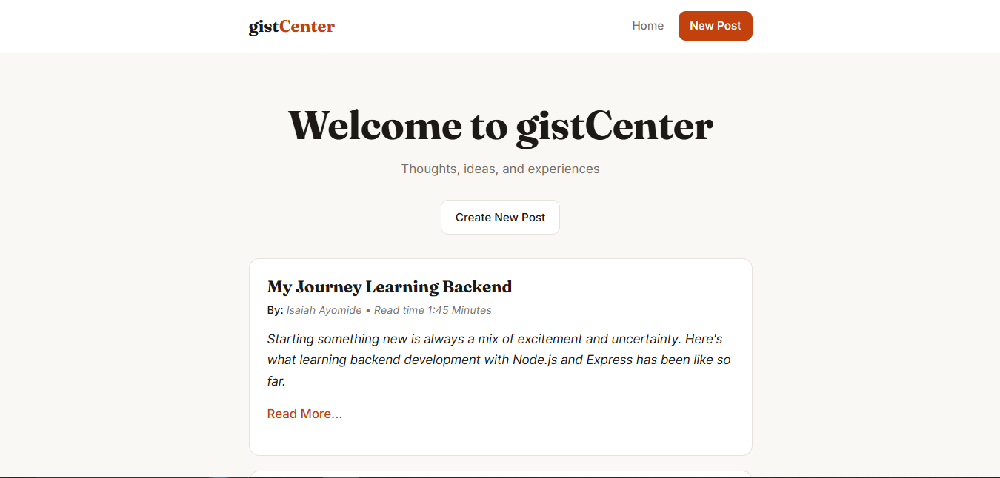
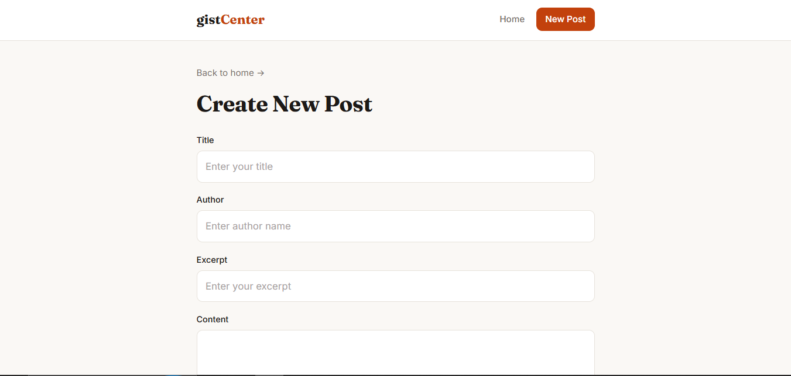

# Gist Blog

A server-rendered blog app built with Node.js, Express and EJS. Posts are stored in memory, so they reset whenever the server restarts.

## Features

- Create new posts
- Read posts on the home page and on their own page
- Edit existing posts
- Delete posts
- Read time calculated automatically from the post content

## Tech stack

- Node.js (ES modules)
- Express
- EJS templates
- body-parser
- Plain CSS

## Run it locally

```bash
git clone https://github.com/yenisaa/gist-blog.git
cd gist-blog
pnpm install
pnpm start
```

Then open http://localhost:3000

For development with auto-restart, use `nodemon index.js`.

## Routes

| Method | Route | What it does |
|--------|-------|--------------|
| GET | `/` | Home page with all posts |
| GET | `/post/:id` | Single post page |
| GET | `/create` | New post form |
| POST | `/create/new` | Saves a new post |
| GET | `/edit/:id` | Edit form for a post |
| POST | `/edit/:id` | Saves changes to a post |
| POST | `/delete/:id` | Deletes a post |

## What I learned

- Links send GET requests and forms send POST, so anything that changes data needs a form
- Reading `req.params` and `req.body`
- Using `find` and `filter` to update and delete items in an array
- Debugging by logging what the server actually receives

## Screenshots




## Limitations and next steps

- Posts are not saved permanently. Next step is to store them in a database
- Add input validation and a custom 404 page
- Add login so only the author can edit and delete posts

## Live Link
Click below to view
- [GistCenter](https://gist-center.onrender.com/)

## Author

Built by Isaiah Ayomide Yenou ([Isaiah Ayomide](https://github.com/yenisaa)).